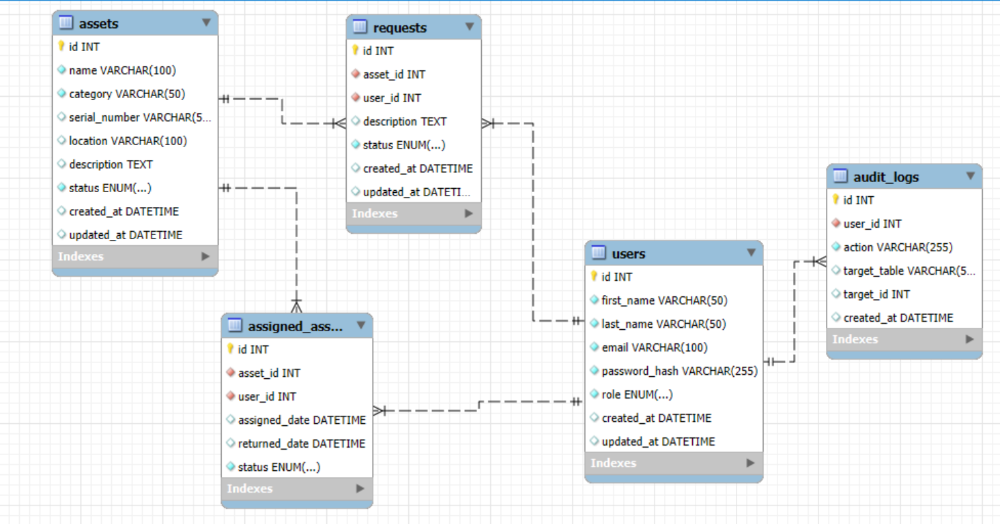

# it-asset-management
IT Asset Management App is a web application that helps IT employees manage, track, and organize company IT equipment efficiently.

## ERD Draft for IT Asset Manager

Here's a draft of the ERD for the IT Asset Management web application. It illustrates the main entities and their relationships in the system:
